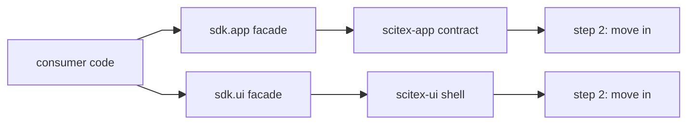

# scitex-sdk (<code>scitex-sdk</code>)

<p align="center">
  <a href="https://scitex.ai">
    
  </a>
</p>

<p align="center"><b>One project for the SciTeX app contract and UI shell.</b></p>

<p align="center">
  <a href="https://scitex-sdk.readthedocs.io/">Full Documentation</a> · <code>uv pip install scitex-sdk[all]</code>
</p>

<!-- scitex-badges:start -->
<p align="center">
  <a href="https://pypi.org/project/scitex-sdk/"></a>
  <a href="https://pypi.org/project/scitex-sdk/"></a>
  <a href="https://scitex-sdk.readthedocs.io/"></a>
</p>
<p align="center">
  <a href="https://github.com/scitex-ai/scitex-sdk/actions/workflows/pytest-matrix-on-ubuntu-py3-11-3-12-3-13.yml"></a>
  <a href="https://github.com/scitex-ai/scitex-sdk/actions/workflows/import-smoke-on-ubuntu-py3-12.yml"></a>
  <a href="https://github.com/scitex-ai/scitex-sdk/actions/workflows/scitex-dev-quality-audit-on-ubuntu-latest.yml"></a>
  <a href="https://codecov.io/gh/scitex-ai/scitex-sdk"></a>
</p>
<!-- scitex-badges:end -->

---

## Problem and Solution

| # | Problem | Solution |
|---|---|---|
| 1 | **Two distributions** version the app contract and UI shell separately. | **One SDK** names, versions, and releases both as a single unit. |
| 2 | **Import rewrites** across apps risk subtle behavior drift. | **Identity re-exports** make the rewrite mechanical and behavior-neutral. |
| 3 | **Big-bang migrations** stall while every consumer converts at once. | **Facade first**, then gradual implementation moves behind shims. |

## Quick Start

```python
from scitex_sdk.app import get_files
from scitex_sdk.ui import list_components
import scitex_app
import scitex_ui

# Round-trip: the facade re-exports are the identical objects.
assert get_files is scitex_app.get_files
assert list_components is scitex_ui.list_components

print("sdk facade OK")
```

## Demo

`scitex_sdk.app` re-exports the documented public surface of `scitex_app`
**by identity** (the same function/class/submodule objects), and
`scitex_sdk.ui` does the same for `scitex_ui`. A consumer's import rewrite
is mechanical and behavior-neutral:

```python
# before
from scitex_app import get_files
from scitex_ui import get_component

# after — identical objects, zero behavior change
from scitex_sdk.app import get_files
from scitex_sdk.ui import get_component
```

`tests/scitex_sdk/test_facade_identity.py` asserts every re-export `is`
the original — a copy or reimplementation fails the suite. See
`examples/01_facade_imports.py` for a runnable version.

## Installation

```bash
uv pip install "scitex-sdk[all]"
```

Requires Python ≥ 3.10. The bare install carries the two facade peers
(`scitex-app`, `scitex-ui`); `[all]` is the batteries-included form and
pulls their full extras transitively.

## Architecture



<p align="center"><sub><b>Figure 1.</b> Facade now, gradual consolidation later.</sub></p>

Step 1 (this release) is a thin facade: `scitex_sdk.app` and
`scitex_sdk.ui` re-export their peers by identity. Step 2 moves the
implementation into `scitex-sdk` while the original distributions stay as
thin compat shims. Step 3 removes the shims once every consumer (hub,
writer, scholar, cards, agent-container GUI) is on `scitex_sdk`. The
static/TS/CSS assets move with the implementation step, not the facade.

## 2 Interfaces

<details>
<summary><strong><code>scitex_sdk.app</code> — the app contract</strong></summary>

```python
from scitex_sdk.app import (
    get_files, list_files, read_file, write_file,
    build_tree, scaffold, validate,
)

tree = build_tree("/data/project")
files = list_files("/data/project")
```

18 names re-exported from `scitex_app` by identity, including the
`FilesBackend` protocol, `chat`/`embed` helpers, and the `paths`,
`validator` submodules.

</details>

<details>
<summary><strong><code>scitex_sdk.ui</code> — the UI shell</strong></summary>

```python
from scitex_sdk.ui import (
    get_component, list_components, get_static_dir,
)

names = list_components()
static = get_static_dir()
```

5 names re-exported from `scitex_ui` by identity. Static/TS/CSS assets
still resolve by the `scitex_ui` app label until step 2 of the roadmap.

</details>

## Part of SciTeX

`scitex-sdk` is part of [**SciTeX**](https://scitex.ai).

> Four Freedoms for Research
>
> 0. The freedom to **run** your research anywhere — your machine, your terms.
> 1. The freedom to **study** how every step works — from raw data to final manuscript.
> 2. The freedom to **redistribute** your workflows, not just your papers.
> 3. The freedom to **modify** any module and share improvements with the community.
>
> AGPL-3.0 — because we believe research infrastructure deserves the same freedoms as the software it runs on.

---

<p align="center">
  <a href="https://scitex.ai" target="_blank"></a>
</p>
